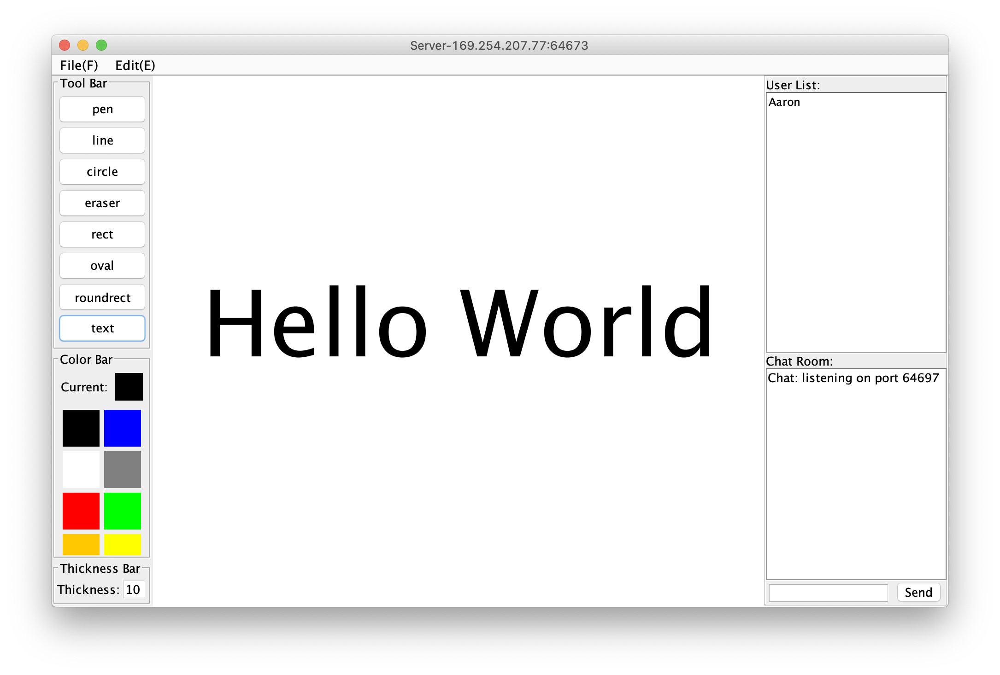

# SharedWhiteBoard
A distribute share white board with chat window.

## Introduction

In this project, we design and implement a shared whiteboard system that can be edited simultaneously, using a P2P structure with a centralized index server. The system supports a range of features such as freehand drawing, drawing multiple shapes such as lines, circles, rectangles, and oval with specific colours and thicknesses. Undo and Redo method is also provided to the user. We also implement a "File" menu, which allows the manager to new, open, or save a file in different formats. Besides, the system also provides a chat window so that all the users in the same shared whiteboard can send messages to each other. Chat contents are encrypted when transmitted, which ensures users' privacy. Moreover, we provide a lobby system for our users to create, join, and search for specific whiteboard rooms, which we think is a very user-friendly improvement.



## Usage

### 1. Run the Centralized Indexed Server

Since the application is implemented using a P2P architecture with a centralizd index server, you have to first run the central server:

```
java --jar CentralServer.jar

```

If no port is provide, the server would run in the port 4444.

Also you can run the server with a specific port:

```
java --jar CentralServer.jar "specific port"
```

In which "specific port" is the port number you want to run the server.

### 2. Run the App

```
java --jar App.jar
```

## More Details

For more details of the project, you can check the `report.pdf` in the `doc/`.  This project is an implementation of the Assignment 2 of COMP90015 Distributed Systems in Melbourne University. 

## Contributors

- [mgsweet](mgsweet.com)
- [Xie Sue](https://github.com/SueXie)
- [Aoqi Zuo](https://github.com/aoqiz)
- [Zhihan Guo](https://github.com/zhihan97)


